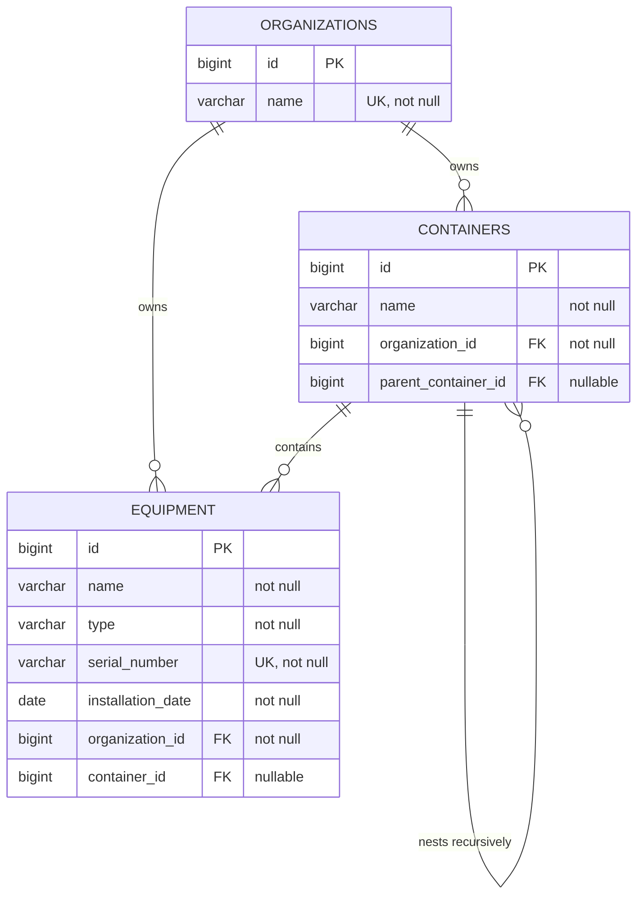

# Radiology Registry Management System - Architectural Documentation

This document provides a comprehensive overview of the architecture, design patterns, domain model, database layout, security design, testing strategy, and DevOps pipeline implementation for the **Radiology Registry Management System** (RRMS).

---

## 1. Architectural Overview

The Radiology Registry Management System is designed as a modular, enterprise-ready application adhering to clean, layered architecture principles. 

### Architectural Layers

1. **Frontend UI Layer (Angular)**: The user interface that handles rendering lists, trees, and form submissions. It routes backend API calls via a proxy server to the backend service.
2. **Presentation Layer (Controllers)**: Receives HTTP requests, performs request schema validations, handles serialization, and exports API specs.
3. **Security Interception (AOP Aspect)**: A cross-cutting concern intercepting restricted operations, validating roles before executing business logic.
4. **Service Layer**: Implements core business logic, coordinates database transactions, enforces validation rules, and maps entities to DTOs.
5. **Domain Model**: Contains pure JPA Entities representing state and database tables.
6. **Data Access Layer (Repositories)**: Abstracts database communications using Spring Data JPA.

### Dependency Flow and Separation of Concerns

The application enforces a strict, unidirectional top-down dependency flow:
$$\text{Angular Frontend} \longrightarrow \text{Controller} \longrightarrow \text{Security Aspect} \longrightarrow \text{Service} \longrightarrow \text{Repository} \longrightarrow \text{PostgreSQL DB}$$

Domain Entities never escape the Service boundary. All external request and response structures utilize immutable DTOs (Data Transfer Objects), which:
- Decouples API contracts from database schema modifications.
- Prevents lazy loading exceptions during JSON serialization.
- Restricts internal metadata (such as DB sequence IDs) from leaking.

### Scalability & Maintainability

- **Scalability**: By resolving container hierarchies in-memory via exactly two optimized SQL queries, we prevent database thread starvation and connection pool exhaustion under high loads.
- **Maintainability**: Clear division of packages (`controller`, `service`, `entity`, `repository`, `dto`, `aspect`, `validator`, `mapper`) guarantees that code remains modular, easily testable, and highly extensible.

### System Architecture Diagram

```
     +-------------------------------------------------------+
     |                 ANGULAR FRONTEND APP                  |
     |          (Serves on port 4200, reverse proxy /api)    |
     +-------------------------------------------------------+
                                 |
                                 v  (Proxy pass HTTP /api calls)
     +-------------------------------------------------------+
     |                       CLIENT / API                    |
     +-------------------------------------------------------+
                                 |
                                 v  (HTTP requests with X-User-Role)
     +-------------------------------------------------------+
     |                     PRESENTATION LAYER                |
     |  +-------------------------------------------------+  |
     |  |       Equipment & Organization Controllers      |  |
     |  +-------------------------------------------------+  |
     +-------------------------------------------------------+
            |                                         ^
            v (Delegates calls)                       | (Aspect Intercepts)
     +-------------------------------------------------------+
     |       AOP SECURITY INTERCEPTOR (SecurityAspect)       |
     +-------------------------------------------------------+
            |
            v
     +-------------------------------------------------------+
     |                       SERVICE LAYER                   |
     |  +---------------------+     +---------------------+  |
     |  |  EquipmentService  |     | OrganizationService |  |
     |  +---------------------+     +---------------------+  |
     |             |                           |             |
     |             v                           v             |
     |  +-------------------------------------------------+  |
     |  |         OrganizationTreeBuilder (Acyclic)       |  |
     |  +-------------------------------------------------+  |
     |  |            EquipmentValidator (Domain)          |  |
     |  +-------------------------------------------------+  |
     +-------------------------------------------------------+
            |
            v
     +-------------------------------------------------------+
     |                       DATABASE LAYER                  |
     |  +-------------------------------------------------+  |
     |  |          Spring Data JPA Repositories           |  |
     |  +-------------------------------------------------+  |
     +-------------------------------------------------------+
                                 |
                                 v
     +-------------------------------------------------------+
     |                    PERSISTENCE STORE                  |
     |                 [ PostgreSQL Database ]               |
     +-------------------------------------------------------+
```

---

## 2. Justification for Main Tech Stack Choices

To ensure suitability for an enterprise medical environment, the tech stack was evaluated and selected based on robust performance, developer velocity, type safety, and testing capabilities:

### Core Frameworks & Languages
* **Java 21 (LTS)**:
  * **Rationale**: Java 21 introduces powerful modern language enhancements including **Java Records** (which we use for clean, boilerplate-free, immutable DTOs), text blocks for cleaner multi-line queries and logs, pattern matching for switch, and compatibility with lightweight virtual threads. It offers long-term enterprise stability, support, and modern performance improvements.
* **Spring Boot 3.3.x**:
  * **Rationale**: Spring Boot is the industry standard for production-ready Java microservices. It provides automated configuration, transactional mapping via JPA, robust dependency injection, validation APIs, and modular componentization. This allows rapid development while keeping the application maintainable.
* **Angular 21.2.x & TypeScript**:
  * **Rationale**: Angular provides a robust, component-driven framework for building scalable SPA (Single Page Application) frontends. TypeScript adds static typing, preventing runtime type errors and accelerating interface development through autocomplete and compile-time verification.
* **PrimeNG 21.1.x**:
  * **Rationale**: Medical user interfaces require advanced widgets such as complex nested tree tables, structured grids, and accessible forms. PrimeNG provides a high-quality suite of pre-styled and highly interactive components that enable building premium dashboards with minimal design overhead.

### Data Layer
* **PostgreSQL 15**:
  * **Rationale**: Relational structures are essential for enforcing medical registry constraints (such as unique equipment serial numbers and foreign key relations). PostgreSQL is a production-grade, ACID-compliant, open-source RDBMS. It handles recursive parent-child lookups and indexes with high throughput and low memory footprint.
* **Liquibase**:
  * **Rationale**: Enables structured, version-controlled database schema migrations. This ensures schema changes are repeatable across local development, CI/CD, and production environments, avoiding manual synchronization issues.

### Testing & QA
* **Vitest**:
  * **Rationale**: Extremely fast, Vite-native testing framework that handles frontend unit tests in a fraction of the time required by traditional Karma/Jasmine runners, maximizing frontend developer iteration speeds.
* **Testcontainers**:
  * **Rationale**: Running integration tests against mock databases (like H2) often masks syntax differences and constraint behavior distinct to PostgreSQL. Testcontainers allows running tests against a real PostgreSQL container, guaranteeing database compatibility and correctness.

---

## 3. Node Recursion & Tree Assembly Strategy

Modern healthcare groups manage nested hierarchies of facility containers (e.g., `Plant -> Building -> Floor -> Ward -> Room -> Cabinet`). Storing these in a fixed relational schema (separate tables for buildings, floors, rooms) results in fragile code, inflexible layouts, and query overhead. 

The system models locations dynamically using a single, self-referential `Container` entity. The primary challenge is assembling this recursive structure without triggering performance bottleneck issues.

### High-Performance In-Memory Tree Assembly

Common recursive tree assembly approaches include SQL Common Table Expressions (CTEs) or JPA lazy loading. However:
* **JPA Lazy Loading (N+1 selects)**: Triggers a new SQL query for every child container layer, leading to hundreds of database queries under nested layouts.
* **Database-level CTEs**: Ties application logic to specific vendor syntax, making database migration difficult and ORM integration complex.

To achieve maximum throughput and database independence, the system implements an **In-Memory Tree Assembly Strategy**:
1. **Exactly Two Database Queries**: To fetch the complete organization hierarchy, the backend runs exactly two simple queries, regardless of how deep the tree is nested:
   ```sql
   -- Query 1: Fetch all containers belonging to the organization
   SELECT * FROM containers WHERE organization_id = :orgId;

   -- Query 2: Fetch all equipment belonging to the organization
   SELECT * FROM equipment WHERE organization_id = :orgId;
   ```
2. **$O(N)$ Assembly Algorithm**: In the [OrganizationTreeBuilderImpl.java](./backend/src/main/java/com/healthcare/radiology_manager/builder/OrganizationTreeBuilderImpl.java), the flat results are processed in linear time:
   * Map all container entities to DTO nodes and store them in an indexed map (`Map<Long, ContainerTreeNode>`).
   * Iterate through the containers: if a container has no parent, add it to the root container list. Otherwise, append it to its parent's child list in the map.
   * Map all equipment units to their containing container DTO node or assign them directly to the organization if they are itinerant.

### Cycle Protection

Self-referential tables are vulnerable to cyclic relationship errors (e.g., Container A references Container B, which references Container A). This causes infinite recursion and results in a `StackOverflowError` in the server.

The builder prevents this using a `visited` Set to track visited nodes during the tree assembly:

```java
private void assembleSubtree(
        ContainerTreeNode node,
        Map<Long, List<ContainerTreeNode>> parentToChildrenMap,
        Map<Long, List<EquipmentResponse>> containerToEquipmentMap,
        Set<Long> visited) {
    
    // Cycle Detection
    if (visited.contains(node.getId())) {
        log.error("Cycle detected in container relationships at node ID: {}. Halting recursion.", node.getId());
        return;
    }
    visited.add(node.getId());

    List<EquipmentResponse> eqList = containerToEquipmentMap.getOrDefault(node.getId(), Collections.emptyList());
    node.setEquipment(new ArrayList<>(eqList));

    List<ContainerTreeNode> children = parentToChildrenMap.getOrDefault(node.getId(), Collections.emptyList());
    for (ContainerTreeNode child : children) {
        node.addSubContainer(child);
        assembleSubtree(child, parentToChildrenMap, containerToEquipmentMap, visited);
    }
}
```

---

## 4. Domain Model Design

The registry domain consists of three core business entities:

1. **Organization**: Represents the top-level healthcare group. It holds administrative ownership of all nested locations and assets.
2. **Container**: Represents a physical container location nested within an organization.
3. **Equipment**: Represents a physical imaging device (CT, MRI, X-ray, etc.) installed inside a container or directly under the organization.

### Entity Relationships

* **Organization to Container**: One-to-many relationship (`@OneToMany`). An organization owns multiple containers.
* **Organization to Equipment**: One-to-many relationship (`@OneToMany`). An organization owns multiple equipment units.
* **Container to Container (Self-Referential)**: Many-to-one relationship (`@ManyToOne`). A container can optionally reference a `parentContainer` and contain multiple `subContainers`.
* **Container to Equipment**: Many-to-one relationship (`@ManyToOne`). Equipment can optionally be placed inside a container. If container is null, the equipment sits directly under the organization.

### Entity-Relationship (ER) Diagram



---

## 5. Database & Security Design

### Database Schema & Performance Indexing

To optimize tree execution and ensure data integrity under high traffic, the system applies database indexes and cascade rules:
* **Indexes**:
  * `idx_container_org` on `containers(organization_id)`: Speeds up container queries for a specific organization.
  * `idx_container_parent` on `containers(parent_container_id)`: Speeds up parent-child traversal.
  * `idx_equipment_org` on `equipment(organization_id)`: Speeds up equipment queries for a specific organization.
  * `idx_equipment_container` on `equipment(container_id)`: Speeds up equipment queries for a specific container.
  * `idx_equipment_serial` (Unique) on `equipment(serial_number)`: Optimizes lookups and enforces serial number uniqueness.
* **Cascade Deletes**: Deletion of an organization or container cascadingly deletes all sub-containers and equipment (`CascadeType.ALL` and `orphanRemoval = true`), preventing orphan records.
* **Domain Validations**: Handled in [EquipmentValidatorImpl.java](./backend/src/main/java/com/healthcare/radiology_manager/validator/EquipmentValidatorImpl.java):
  * Ensures that the assigned `containerId` belongs to the same `organizationId` specified in the request.
  * Checks for serial number uniqueness before executing insertions.

### Security Architecture

The application enforces role-based authorization restricting write actions (registering equipment, modifying containers) to administrators.

* **Aspect-Oriented Security Interceptor**: Rather than importing the full Spring Security stack for a proof of concept, authorization is handled by an AOP aspect defined in [SecurityAspect.java](./backend/src/main/java/com/healthcare/radiology_manager/aspect/SecurityAspect.java).
* **Role Check**: Endpoints requiring authorization are annotated with `@RequireRole("ADMIN")`. The aspect intercepts calls, checks the HTTP header for `X-User-Role: ADMIN`, and blocks unauthorized requests by throwing an `AccessDeniedException` (mapped to `403 Forbidden`).

---

## 6. Testing Strategy

The project implements a testing strategy combining unit tests for isolated component verification and integration tests for end-to-end flow validation.

* **Unit Tests**: Use **JUnit 5** and **Mockito** to verify component behavior in isolation (e.g., [EquipmentServiceUnitTest.java](./backend/src/test/java/com/healthcare/radiology_manager/service/EquipmentServiceUnitTest.java) for services, [EquipmentValidatorUnitTest.java](./backend/src/test/java/com/healthcare/radiology_manager/validator/EquipmentValidatorUnitTest.java) for validations, and [OrganizationTreeBuilderUnitTest.java](./backend/src/test/java/com/healthcare/radiology_manager/builder/OrganizationTreeBuilderUnitTest.java) for the tree assembly algorithm).
* **Integration Tests**: [RadiologyServicesIntegrationTest.java](./backend/src/test/java/com/healthcare/radiology_manager/service/RadiologyServicesIntegrationTest.java) executes database integrations. It spins up an ephemeral PostgreSQL instance using **Testcontainers**, runs Liquibase migrations, and executes test operations against a real database instance to verify query behavior and database constraint enforcement.

---

## 7. DevOps & CI/CD Pipeline Configuration

The DevOps lifecycle is split between continuous integration verification checks and continuous delivery deployment automation.

### Continuous Integration (GitHub Actions)

The pipeline defined in [.github/workflows/ci.yml](./.github/workflows/ci.yml) runs automatically on pushes and pull requests to all branches.

> [!IMPORTANT]
> **GitHub Actions is used strictly for Commit & Push verification checks.**
> It compile and checks code health, runs tests (using Testcontainers), generates code coverage reports, and confirms that the Docker image builds successfully. It does NOT publish images to registry repositories or deploy them to servers.

* **CI Flow**:
  1. **Checkout Code**: Checks out repository files.
  2. **JDK Setup**: Prepares JDK 21 (Temurin distribution) and caches Maven dependencies.
  3. **Build & Test**: Runs `mvn -B clean verify` in the `backend/` directory, which executes all unit tests and database integration tests.
  4. **Upload Reports**: Uploads test results and JaCoCo code coverage reports as workflow artifacts.
  5. **Build Docker Image**: Runs `docker build` using the commit SHA as the tag (`radiology-manager:${{ github.sha }}`) to verify that container builds succeed without issues.

---

### Continuous Delivery & Deployment (Jenkins Pipeline)

Continuous Delivery (CD) is automated via the [Jenkinsfile](./Jenkinsfile) in the repository. Jenkins handles building, tagging, publishing, and deploying container images to staging or production.

* **CD Flow**:
  1. **Checkout**: Pulls code from repository.
  2. **Build & Test**: Compiles the backend project and runs verification tests.
  3. **Quality & Security Gates**: Integrates **SonarQube** code quality analysis to enforce quality gates and a **Trivy** vulnerability scan on dependencies before building the final containers.
  4. **Docker Build & Push**: Builds the production image, tags it with the Jenkins build number and `latest`, runs a **Trivy** container image vulnerability scan, authenticates with a Docker registry (e.g., GitHub Container Registry - GHCR), and pushes the images.
  5. **Deployment Options**: Depending on the target environment variable (`DEPLOY_TARGET`), Jenkins executes deployment via one of two strategies:
     * **Option 1: Deploy to Standalone Docker**
       * If deploying to `localhost` or remote servers via SSH, Jenkins pulls the image, terminates older containers on the custom `radiology-net` network, and starts the container with production profiles and parameters.
     * **Option 2: Deploy to K3s (Kubernetes)**
       * Jenkins replaces the image placeholders in Kubernetes manifests (`k8s/app-deployment.yaml`).
       * Generates Kubernetes Secrets containing database credentials.
       * Applies configurations to the Kubernetes cluster using `kubectl` (applying PVC, Deployment, Service, ConfigMap, and Ingress resources) and monitors rollout status.

---

## 8. POC Local Deployment Guide & Server Production Strategy

As this is a Proof of Concept (POC), we have built support for deploying the application locally using two approaches, while planning for production deployment to remote cloud/on-prem servers following industry-standard DevOps principles.

### A. POC Local Deployment Options

The local infrastructure stack can be run in the background using Docker Compose. The `docker-compose-infra.yml` file contains services for running a local DevOps setup:
- **infra-jenkins**: Runs a local Jenkins automation server (available on port `9090`).
- **infra-k3s**: Runs a lightweight Rancher K3s Kubernetes server (available on port `6443`).

To boot the local infrastructure:
```bash
docker-compose -f docker-compose-infra.yml up -d
```

Once local infrastructure is running, you can choose between two deployment strategies:

#### Option 1: Local Standalone Docker Container
You can deploy the app to the local Jenkins runner docker daemon or trigger it manually:

* **Triggering via local Jenkins**:
  1. Configure a pipeline project in local Jenkins pointing to the repository.
  2. Set environment variable `DEPLOY_TARGET=docker` and `PRODUCTION_HOST=localhost`.
  3. Run the build. Jenkins will build the image, spin down old app containers, create the network bridge `radiology-net`, and start the app on port `8080`.
* **Triggering manually via CLI**:
  1. Build the app container image:
     ```bash
     docker build -t radiology-manager:local -f Dockerfile .
     ```
  2. Create a bridge network:
     ```bash
     docker network create radiology-net || true
     ```
  3. Run the database container:
     ```bash
     docker run -d --name radiology-db --network radiology-net -e POSTGRES_DB=radiologydb -e POSTGRES_USER=admin -e POSTGRES_PASSWORD=secretpassword -p 5432:5432 postgres:15-alpine
     ```
  4. Run the app container:
     ```bash
     docker run -d --name radiology-manager --network radiology-net -p 8080:8080 -e SPRING_PROFILES_ACTIVE=dev -e SPRING_DATASOURCE_URL=jdbc:postgresql://radiology-db:5432/radiologydb -e SPRING_DATASOURCE_USERNAME=admin -e SPRING_DATASOURCE_PASSWORD=secretpassword radiology-manager:local
     ```

#### Option 2: Local Kubernetes Deployment (K3s)
Deploy to the local K3s cluster. K3s provides a production-like orchestration sandbox locally:

* **Triggering via local Jenkins**:
  1. Set environment variable `DEPLOY_TARGET=k3s`.
  2. Provide K3s Kubeconfig credentials mapping to `k3s-kubeconfig.yaml`.
  3. Run the build. Jenkins will replace image tags in K8s templates and apply all resource manifests.
* **Triggering manually via CLI**:
  1. Export the Kubeconfig file to point your local terminal commands to the K3s cluster:
     ```bash
     export KUBECONFIG=$(pwd)/k3s-kubeconfig.yaml
     ```
  2. Load the built Docker image directly into the K3s runtime cache:
     * In K3s, load the local image:
       ```bash
       docker save radiology-manager:local | docker exec -i infra-k3s ctr images import -
       ```
  3. Replace `IMAGE_PLACEHOLDER` with `radiology-manager:local` inside `k8s/app-deployment.yaml`.
  4. Create the Postgres secret and apply storage/deployment configurations:
     ```bash
     kubectl apply -f k8s/postgres-secret.yaml
     kubectl apply -f k8s/postgres-pvc.yaml
     kubectl apply -f k8s/postgres-deployment.yaml
     kubectl apply -f k8s/postgres-service.yaml
     ```
  5. Apply the app configurations and deployment:
     ```bash
     kubectl apply -f k8s/app-configmap.yaml
     kubectl apply -f k8s/app-deployment.yaml
     ```
  6. Expose the app routing through services and ingress:
     ```bash
     kubectl apply -f k8s/app-service.yaml
     kubectl apply -f k8s/app-ingress.yaml
     ```
  7. Check deployment rollout progress:
     ```bash
     kubectl rollout status deployment/radiology-manager
     ```
  8. Once running, map the domain `radiology.local` in `/etc/hosts` to point to `127.0.0.1` to access via browser.

---

### B. Production Server Deployment Strategy

Deploying to production requires migrating from a local sandbox to automated, secure cloud/on-prem infrastructure.

```
 +-----------------+      +-----------------+      +-----------------+      +-----------------+
 | 1. CI pipeline  | ---> | 2. Private Repo | ---> | 3. CD Triggered | ---> | 4. K8s Deploy   |
 |  verify/compile |      |   Registry Push |      |   to Prod Env   |      |  Rolling Update |
 +-----------------+      +-----------------+      +-----------------+      +-----------------+
```

#### Step-by-Step Production Setup:
1. **Infrastructure Provisioning**: Use Infrastructure as Code (IaC) tools like **Terraform** or **OpenTofu** to provision server nodes, load balancers, and a cloud-managed PostgreSQL database instance (such as AWS RDS PostgreSQL or GCP Cloud SQL) inside a secure Virtual Private Cloud (VPC).
2. **Secure Containers Registry**: Create repositories in private registries (such as AWS ECR, Azure ACR, or a secure private Harbor instance) to store production-signed Docker images.
3. **Secrets Management**: Set up a dedicated credentials manager (like **HashiCorp Vault**, **AWS Secrets Manager**, or K8s External Secrets Operator). Never deploy plain secrets or commit them to the repo.
4. **Deploying the Application**:
   * **Using Kubernetes (Recommended)**: Set up production K8s clusters (EKS, GKE, AKS) and deploy using packaged Helm Charts. Replace static templates with Helm values files separating staging and production parameters.
   * **Using Standalone Production Servers**: Set up deployment runners using Ansible or SSH deployment hooks in CD pipelines to pull private registry images and restart services with zero footprint exposure.
5. **Ingress & SSL Termination**: Configure a central Ingress Controller (like Traefik, Nginx, or AWS ALB Controller) with automated SSL certificate provisioning via **cert-manager** and Let's Encrypt.

---

### C. DevOps Principles to Follow

To guarantee safety, reliability, and security in production, the following core DevOps principles must be enforced:

1. **Infrastructure as Code (IaC)**: Declaring environments (networks, databases, cluster nodes) programmatically ensures environments are identical, prevents configuration drift, and allows recreating infrastructure instantly.
2. **Environment Consistency**: Packaged container images (Docker) must run identically from the local workspace up to production. App configurations must be externalized (ConfigMaps/Environment variables), keeping the underlying code image environment-agnostic.
3. **Continuous Integration & Automated Testing (CI)**: No code goes to production without verification. Every merge request must undergo unit tests, integrations (via Testcontainers), code quality checks (using **SonarQube** to enforce quality gates), and vulnerability scans (using **Trivy** to check dependency and container security).
4. **Automated Continuous Delivery (CD)**: Eliminate manual server access. All server deployments must run through automated CD pipeline pipelines (Jenkins/GitLab CI/ArgoCD) triggered by Git tags or specific branches (e.g., `main`).
5. **Rolling Updates & Zero Downtime**: Kubernetes rolling update strategy (defined in `k8s/app-deployment.yaml` with `replicas: 2` and `rollingUpdate`) ensures that new containers start and pass readiness probes before old ones are terminated. Database schema updates (via Liquibase) must be backwards-compatible (expand-and-contract pattern) to avoid breaking active containers during deployment updates.
6. **Observability & Proactive Alerting**: 
   * **Probes**: Implement Kubernetes `readinessProbe` and `livenessProbe` pointing to Spring Boot Actuator endpoints (`/actuator/health/readiness` and `/actuator/health/liveness`) to auto-restart frozen containers.
   * **Monitoring**: Set up Prometheus to collect application, system, and connection pool metrics, and visualize them using Grafana dashboards.
   * **Logging**: Centralize container logs (using ELK/EFK stacks or Grafana Loki) to debug production runtime bugs without server access.
7. **Security Hardening**:
   * Run applications as non-root users (`appuser` with UID 10001) as configured in the `Dockerfile` and `app-deployment.yaml`.
   * Drop unnecessary Linux kernel capabilities (`capabilities: drop: [ALL]`) and disable privilege escalation.
   * Regularly audit database credentials and encrypt data in transit (TLS) and at rest.

---

## 9. Local vs. Production Environments Configuration

Certain design aspects differ between local sandbox environments and production environments to streamline development while securing the app at scale:

| Component | Local Sandbox / Testing Environment | Production Environment |
| :--- | :--- | :--- |
| **Security & Auth** | Mock AOP aspect intercepting `X-User-Role` HTTP header to simulate role checks. | OAuth2/OIDC Resource Server verifying cryptographically signed JWT tokens issued by Keycloak/Okta/Auth0. |
| **Database** | Docker-Compose running local PostgreSQL container (mapped to `127.0.0.1:5432`). | High-Availability Database Cluster (AWS RDS, CockroachDB, or self-hosted PostgreSQL replica clusters) with SSL enabled. |
| **DevOps Infrastructure** | Local DevOps environment (Jenkins & K3s) can be run locally using `docker-compose-infra.yml`. | Dedicated CI/CD runners deploying to centralized staging or production Kubernetes clusters (EKS, GKE, or On-Prem K8s). |
| **Code Quality & Security** | Basic compiler/JUnit tests without automated security gates. | Automated **SonarQube** analysis for code quality gates and **Trivy** scanning for container/dependency vulnerabilities built into the production CI/CD pipeline. |
| **Caching** | Direct database queries (two flat queries). | Distributed cache (Redis cluster) saving organization trees in-memory for $O(1)$ read performance. |
| **Monitoring** | Console logging and standard HTTP outputs. | Prometheus scraping metrics from Spring Boot Actuator, visualized via Grafana dashboards. |
| **Frontend Serving** | Angular local dev server on port 4200 proxied to `localhost:8080`. | Angular assets served by highly-optimized Nginx reverse proxy containers handling SSL termination. |

---

## 10. API Documentation

### 1. Register New Radiological Equipment
* **Endpoint**: `POST /api/equipment`
* **Authentication**: Requires HTTP header `X-User-Role: ADMIN`
* **Request Headers**:
  * `Content-Type: application/json`
  * `X-User-Role: ADMIN`
* **Validation Rules**:
  * `name`: Must not be blank.
  * `type`: Must not be blank.
  * `serialNumber`: Must not be blank.
  * `installationDate`: Must not be null (formatted `YYYY-MM-DD`).
  * `organizationId`: Must reference an existing organization.
  * `containerId` (Optional): If provided, must reference an existing container owned by the same organization.

#### Request JSON Example:
```json
{
  "name": "GE Revolution CT Scan v2",
  "type": "CT",
  "serialNumber": "SN-CT-9999",
  "installationDate": "2026-06-19",
  "organizationId": 1,
  "containerId": 3
}
```

#### Success Response (201 Created):
```json
{
  "id": 101,
  "name": "GE Revolution CT Scan v2",
  "type": "CT",
  "serialNumber": "SN-CT-9999",
  "installationDate": "2026-06-19",
  "organizationId": 1,
  "containerId": 3
}
```

#### Error Responses:
* **400 Bad Request** (Schema validation failed)
* **403 Forbidden** (Missing or invalid user role header)
* **404 Not Found** (Associated organization or container not found)
* **409 Conflict** (Duplicate Serial Number)

---

### 2. Retrieve Organization Location & Equipment Tree
* **Endpoint**: `GET /api/organizations/{id}/tree`
* **Authentication**: None (Publicly readable)
* **Path Parameter**:
  * `id` (Long, Required): Database ID of the organization to retrieve.

#### Success Response (200 OK):
```json
{
  "id": 1,
  "name": "San Raffaele Hospital Group",
  "equipment": [
    {
      "id": 4,
      "name": "Hologic Selenia Mammography Van",
      "type": "Mammogram",
      "serialNumber": "SN-MG-404",
      "installationDate": "2022-11-05",
      "organizationId": 1,
      "containerId": null
    }
  ],
  "containers": [
    {
      "id": 1,
      "name": "Plant A",
      "containers": [
        {
          "id": 2,
          "name": "Building 2",
          "containers": [
            {
              "id": 3,
              "name": "Radiology Department",
              "containers": [],
              "equipment": [
                {
                  "id": 1,
                  "name": "GE Revolution CT Scan",
                  "type": "CT",
                  "serialNumber": "SN-CT-101",
                  "installationDate": "2023-01-15",
                  "organizationId": 1,
                  "containerId": 3
                }
              ]
            }
          ],
          "equipment": []
        }
      ],
      "equipment": []
    }
  ]
}
```

### Postman Collection for Testing

A Postman collection is provided at the root of the project to test these two key APIs: [radiology-manager.postman_collection.json](./radiology-manager.postman_collection.json).
- **Base URL Variable**: `baseUrl` = `http://localhost:8080`
- **Role Header**: `X-User-Role: ADMIN` is preconfigured for the write operations in the collection's headers.

---

## 11. Future Enhancements & Production Roadmap

* **JWT & OAuth2 Integration**: Replace simple AOP role checking with authentication filters integrated with Keycloak/Auth0.
* **Distributed Caching (Redis)**: Cache the assembled organization tree structure to optimize read performance and decrease database CPU loads during bulk reads.
* **Observability Suite**: Configure Spring Boot Actuator to export connection pool and JVM metrics to Prometheus, visualised via Grafana dashboards.
* **Audit Trail (Spring Data Envers)**: Log changes to organization, container, and equipment tables to support clinical auditing.
* **Frontend State Management**: Integrate NgRx or RxJS reactive state stores to cache loaded tree networks, avoiding redundant network requests.
* **Helm Charts**: Package Kubernetes deployments into custom Helm charts, enabling dynamic deployment variables, resource budgets, and replicas management.
